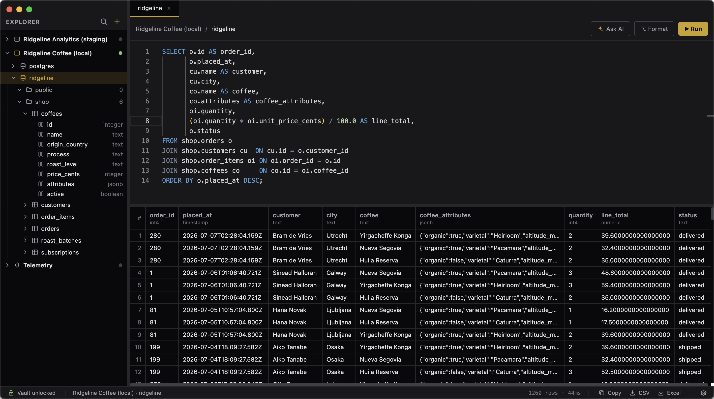
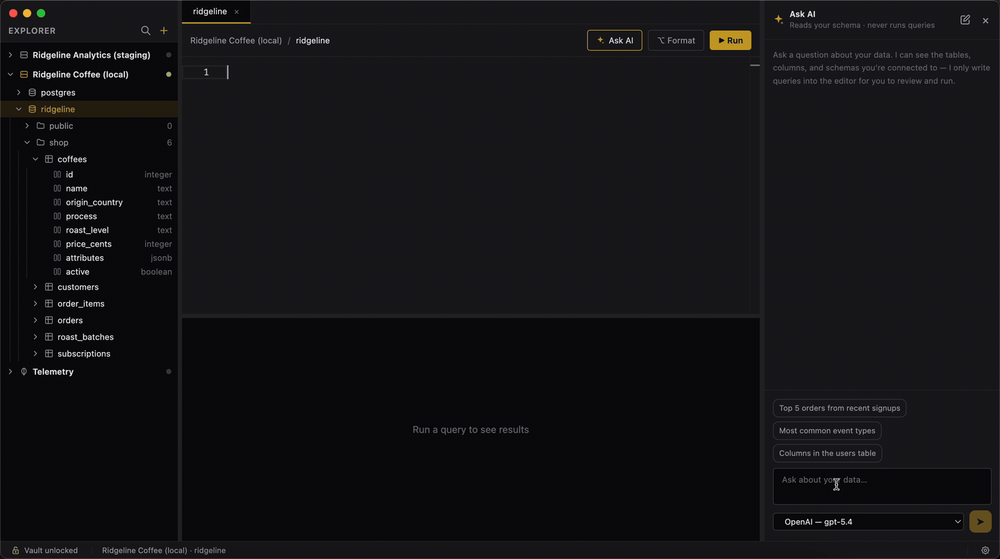

# Downpick

A desktop database manager for PostgreSQL, SQL Server, Oracle, and MongoDB, with an encrypted credential
vault and an AI assistant that writes queries from your schema. Runs as a native app on Windows,
macOS, and Linux.



## Install

Download the latest build from the [releases page](https://github.com/downpick/downpick/releases/latest).

| Platform | File | How to run it |
|---|---|---|
| **macOS** (Apple Silicon) | `Downpick-<version>-arm64.dmg` | Open the dmg, drag Downpick to Applications |
| **macOS** (Intel) | `Downpick-<version>.dmg` | Same |
| **Linux** (x64) | `Downpick-<version>.AppImage` | `chmod +x` it, then run it |
| **Windows** (x64) | `Downpick-<version>-win.zip` | Extract anywhere, run `Downpick.exe` |

**The builds are unsigned**, so both desktop platforms will warn you on first launch. On macOS,
Gatekeeper says it can't verify the developer. Open it once from **System Settings → Privacy &
Security → Open Anyway**, or clear the quarantine flag yourself:

```bash
xattr -dr com.apple.quarantine /Applications/Downpick.app
```

Either way you only do it once. If macOS instead claims the app is **damaged**, you have a build
from before 1.0.1 — that message was a packaging bug, not a bad download; grab a newer release.

On Windows, SmartScreen shows a blue banner — choose **More info → Run anyway**. Verify what you
downloaded against the SHA-256 checksums published in the release notes.

### From source

Node.js 20+ and npm 9+:

```bash
git clone https://github.com/downpick/downpick.git && cd downpick && npm install && cd client && npm install && cd ..
```

```bash
npm run build && npm start
```

To build redistributables yourself, see [docs/releasing.md](docs/releasing.md).

## Features

- Connect to multiple PostgreSQL, SQL Server, Oracle, and MongoDB databases at once, with a
  schema explorer down to columns (or collections, on MongoDB)
- Monaco editor with syntax highlighting and autocomplete for both SQL and MongoDB shell-style
  queries — `db.users.find({...}).sort({...}).limit(20)` runs as written
- **Ask AI**: describe what you want in plain language and an LLM reads your schema and writes the
  query into the editor — it has no tool that executes anything ([details](#ask-ai))
- Virtualized results grid for large result sets, with MongoDB documents viewable as a flattened
  table or an expandable per-document tree
- Copy results as a table (pasteable into Slack, Sheets, or Excel) or export to CSV / Excel
- Run the whole editor, or just the selection — plus **Query ▸ Run Statement** (F9) to run only
  the statement under the cursor
- Cancel a running query mid-flight, plus a configurable timeout that cancels it for you
- Confirmation before any `UPDATE`/`DELETE` with no `WHERE` clause, or `updateMany`/`deleteMany`
  with an empty filter
- Open tabs, pane sizes, and window position all persist across restarts

## Security

Everything sensitive lives in a single encrypted vault at `~/.downpick/vault.enc`. A master
password is stretched with scrypt into a key that wraps a random data key; the vault starts locked
on every launch, and every IPC channel outside `vault:*` and `settings:get` is refused until you
unlock it. The renderer runs fully sandboxed with no Node access and no network permission of any
kind.

**There is no recovery.** If you forget the master password, nothing in the vault can be decrypted
— by you or anyone else.

[SECURITY.md](SECURITY.md) has the full design, including an honest list of what it deliberately
does *not* protect against.

## Oracle

Oracle connections need **no client software installed** — no Instant Client, no ODBC or JDBC
driver, no `ORACLE_HOME`. Downpick uses node-oracledb in Thin mode, which is pure JavaScript and
talks to the database directly.

What that implies:

- **Oracle Database 12.1 or newer.** Thin mode cannot talk to 11g or older.
- **Service name, not SID.** Oracle is the one engine whose databases cannot be enumerated, so the
  connection dialog asks for a Service Name. `lsnrctl status` on the server lists them. A wrong one
  produces ORA-12514, which Downpick explains and points back at the field.
- **The schema explorer shows application schemas only** — those with
  `ALL_USERS.ORACLE_MAINTAINED = 'N'` — so `SYS`, `SYSTEM`, `XDB` and the rest of Oracle's own
  accounts stay out of the tree. Your own schema sorts first.
- **Oracle Wallets must be PEM.** Connecting to Autonomous Database over mTLS works, but the
  `cwallet.sso` format does not; Thin mode needs the PEM.
- **Native Network Encryption is not supported.** TLS is. A server with
  `SQLNET.ENCRYPTION_SERVER = REQUIRED` cannot be reached.

### Statements and transactions

Oracle executes one statement per call, so Downpick splits your script and runs the statements in
order, **stopping at the first failure**. The statements that already ran are reported in the
Messages view.

> **Each statement is committed as it runs.** This differs from SQL\*Plus, SQL Developer, and Toad,
> which default to manual commit and give you Commit/Rollback buttons. A five-statement script is
> five transactions here: if statement three fails, statements one and two are already committed and
> are **not** rolled back. Downpick has no transaction control for any engine yet — the confirmation
> prompt before an `UPDATE`/`DELETE` with no `WHERE` is the safety net until it does.

Two type notes:

- Unconstrained Oracle `NUMBER` columns hold up to 38 digits; JavaScript numbers carry about 15, so
  very large or very precise values may lose precision in the grid.
- Oracle `DATE` and `TIMESTAMP` carry no time zone, so they are read in the app's local zone and
  displayed as UTC. A `DATE '2026-01-15'` shows as `2026-01-15T03:00:00.000Z` on a UTC-3 machine.
  This matches how PostgreSQL `timestamp` columns already behave here.

## Ask AI

Click **✦ Ask AI** in the editor toolbar and ask a question in plain language. The assistant reads
your schema through read-only tools — `list_schemas`, `list_tables`, `describe_tables` — and has
no tool that executes anything. The query it writes goes into the editor when you click **Insert
into editor**; running it is still your click on **Run**, still behind the `WHERE`-clause
confirmation.



Conversations are kept. Each tab has its own, and the **history** button in the panel header
lists every past chat — click one to pick it back up, or clear them all from the same place. They
are saved to `~/.downpick/chats.db` in plain text, so treat that file the way you would your query
history.

**What leaves your machine:** your question, the conversation so far, and the *names* of the
schemas, tables, and columns the assistant looks up. No row data is ever sent — it cannot read
any, because it cannot run a query. On MongoDB, `describe_tables` samples up to 50 documents to
learn field names and types; the sampled values are read in the main process and discarded, and
only names and types reach the model.

**Providers:** Settings → AI providers takes OpenAI, Anthropic, Google Gemini, Azure OpenAI, and
any OpenAI-compatible endpoint — including local ones like `http://localhost:11434/v1` for Ollama.
Keys are stored in the same encrypted vault as your database passwords and are never sent back to
the renderer. **Fetch from API** asks the provider which models your key can actually use, and
**Add a model id** takes anything you type, so a model newer than this release still works.

## Settings

Open with the **⚙** button at the right end of the status bar along the bottom of the window, or
with `Ctrl+,` / `Cmd+,`. The dialog has four sections.

**General**

| Setting | What it does |
|---|---|
| **Restore open tabs on launch** | Reopens the tabs you had open last time. Turn it off if your query text is sensitive — the tabs are stored in plaintext. |
| **Query timeout** | Cancels a query still running after this long (0–3600 seconds, default 30s, `0` for no limit). |

**Notifications**

| Setting | What it does |
|---|---|
| **Notify me when a query finishes** | Announces a finished query — a system notification when Downpick is in the background, an in-app notice when it is not, never both. A query you cancelled or one the database rejected is not announced, since you are right there either way. Clicking the system notification brings the window forward and opens the tab the query came from. |
| **Only after _n_ seconds** | How long a query must have run to be worth announcing (0–3600 seconds, default 10s, `0` announces every query). A query stopped by the **Query timeout** in General is exempt and always announced — the point of setting that limit is to be told when it trips, and it would otherwise go silent whenever the timeout was shorter than this threshold. |
| **Send a test notification** | Raises one on demand, ignoring both settings above. Your OS has to allow notifications from Downpick as well, and a blocked one is turned away without an error — there is no way to detect that from inside the app, so the only honest check is to fire one and look. |

**Security**

| Setting | What it does |
|---|---|
| **Vault file path** | Where the encrypted vault lives — point it at an encrypted volume if you like. **Browse…** picks a vault you already have and **New location…** chooses where a new one goes, or type the path yourself — it must include the filename. Changing it locks the current vault; the file at the new path has its own master password, and one is created if it does not exist. The same choice is offered on first launch, before any vault exists. |
| **Change master password** | Re-encrypts the vault key under a new password and deletes the previous backup file, which is still readable with the old one. |
| **Auto-lock** | Re-locks the vault and closes every open database connection after this much inactivity (0–1440 minutes, `0` never auto-locks). Tracks IPC activity rather than mouse movement, so a long query is never interrupted by its own timeout. |

**AI providers** — the providers Ask AI can use; see [Ask AI](#ask-ai) above. It saves each change
as you make it rather than on a Save button, so it has a plain **Close**. Jump straight to it with
`Ctrl+Shift+,` / `Cmd+Shift+,`.

Vault path, query timeout, notification preferences, and auto-lock live in
`~/.downpick/settings.json`, which holds no secrets. Tab restoration is a renderer-side preference and is stored with the tabs themselves.
Ask AI conversations are saved to `~/.downpick/chats.db`, unencrypted — see
[SECURITY.md](SECURITY.md).

## Keyboard Shortcuts

| Shortcut | Action |
|----------|--------|
| `Ctrl+Enter` / `Cmd+Enter` / `F5` | Execute query (or just the selected text, if any) |
| `Ctrl+Shift+Enter` / `Cmd+Shift+Enter` | Cancel the running query |
| `Shift+Alt+F` | Format the query |
| `Ctrl+N` / `Cmd+N` | New connection |
| `Ctrl+,` / `Cmd+,` | Open Settings |
| `Ctrl+Shift+,` / `Cmd+Shift+,` | Open Settings, straight to AI providers |
| `Ctrl+L` / `Cmd+L` | Lock the vault |
| `Enter` / `Shift+Enter` | In the Ask AI box: send the question / insert a newline |

Everything except the Ask AI box and `F5` is also on the application menu, which is where the
accelerators are registered.

## Documentation

- [CONTRIBUTING.md](CONTRIBUTING.md) — dev mode, tests, packaging, and adding a database engine
- [docs/releasing.md](docs/releasing.md) — building the redistributables and publishing a release
- [SECURITY.md](SECURITY.md) — the vault, process isolation, and known limits
- [docs/ipc.md](docs/ipc.md) — the IPC channel contract between renderer and main

## License

MIT — see [LICENSE](LICENSE).
